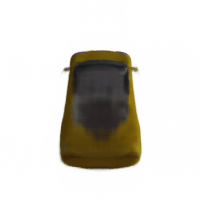
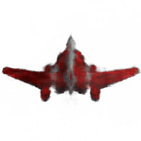
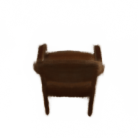
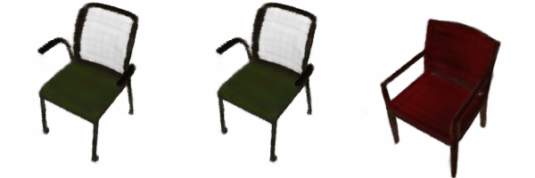

# Points2NeRF: Generating Neural Radiance Fields from 3D point cloud

  

| arXiv |
| :---- |
| [Points2NeRF: Generating Neural Radiance Fields from 3D point cloud](https://arxiv.org/pdf/2206.01290.pdf)|

Model based on VAE/Hypernetwork architecture, takes as input colored cloud of points, encodes them into latent space and generates NeRF (xyz$\alpha\beta$ -> RGB) functions that can be used in volumetric rendering reconstruction.

### Abstract
*Contemporary registration devices for 3D visual information, such as LIDARs and various depth cameras, capture data as 3D point clouds. In turn, such clouds are challenging to be processed due to their size and complexity. Existing methods address this problem by fitting a mesh to the point cloud and rendering it instead. This approach, however, leads to the reduced fidelity of the resulting visualization and misses color information of the objects crucial in computer graphics applications. In this work, we propose to mitigate this challenge by representing 3D objects as Neural Radiance Fields (NeRFs). We leverage a hypernetwork paradigm and train the model to take a 3D point cloud with the associated color values and return a NeRF network's weights that reconstruct 3D objects from input 2D images. Our method provides efficient 3D object representation and offers several advantages over the existing approaches, including the ability to condition NeRFs and improved generalization beyond objects seen in training. The latter we also confirmed in the results of our empirical evaluation.*

## Requirements
- Dependencies stored in `requirements.txt`.
- submodule 
- Python 3.9.12
- CUDA

## Usage

### Installation
Create new conda environment 
 `pip install -r requirements.txt`
 
### Training
Edit config file, by setting up dataset and results paths:

`python pts2nerf.py config_cars.json`

Results will be saved in the directory defined in config file.

### Evaluation and Sampling

For calculating metrics:
`python eval.py config_cars.json`

For sampling images, interpolations:

`python render_samples.py config_cars.json -o_anim_count=10 -g_anim_count=25 -i_anim_count=5 -train_ds=0 -epoch=1000`

Above line, will render: 10 objects reconstruction image sets, 25 generated objects, 5 interpolations.
For each object, and some interpolation steps, script will have 3D object produced using marching cubes algorithm.

### Prepared Dataset

[Download Dataset here.](https://ujchmura-my.sharepoint.com/:u:/g/personal/przemyslaw_spurek_uj_edu_pl/ETy5BPpf4ZFLorYEpXxhRRcBY1ASvCqDCgEX_h75Um6MlA?e=MTJdaj)

Folders should be placed in a local folder specified in config file for specified experiment.
For metrics calculation you need to download a ShapenetCore.V2 by yourself and specify its' location in a config file.

### Data Preparation
  
Use scripts found in `dataset_generation_scripts` folder. Create new `conda` environment if you need.
Or download provided data: ShapeNet cars, planes, chairs with 50 renders, each 200x200 on 2048 colored points.

1. Download ShapeNet, or other dataset of your choice which has 3D models
2. If using ShapeNet convert to `.gltf` extension (this removes duplicate faces etc.)
3. Use `cloud_exporter.py` to sample colored point cloud from objects.
4. Render them using `generate.py` which requires `Blender`
5. Put them in separate folder with structure: `dataset_path_from_config_file/<category_name>/sampled/<img_count>_<shapenet_name>.npz`
6. Use that `ds` folder as input for training.

Note:
- <shapenet_name> is required if you want evaluation to find original `.obj` files in order to sample and compare points position with model reconstruction.
- training requires considerable amount of GPU memory, it can be reduced by changing parameters in the `config` files (`N_samples`, `N_rand`, `chunk` sizes for target NeRF networks and the Hypernetwork)
